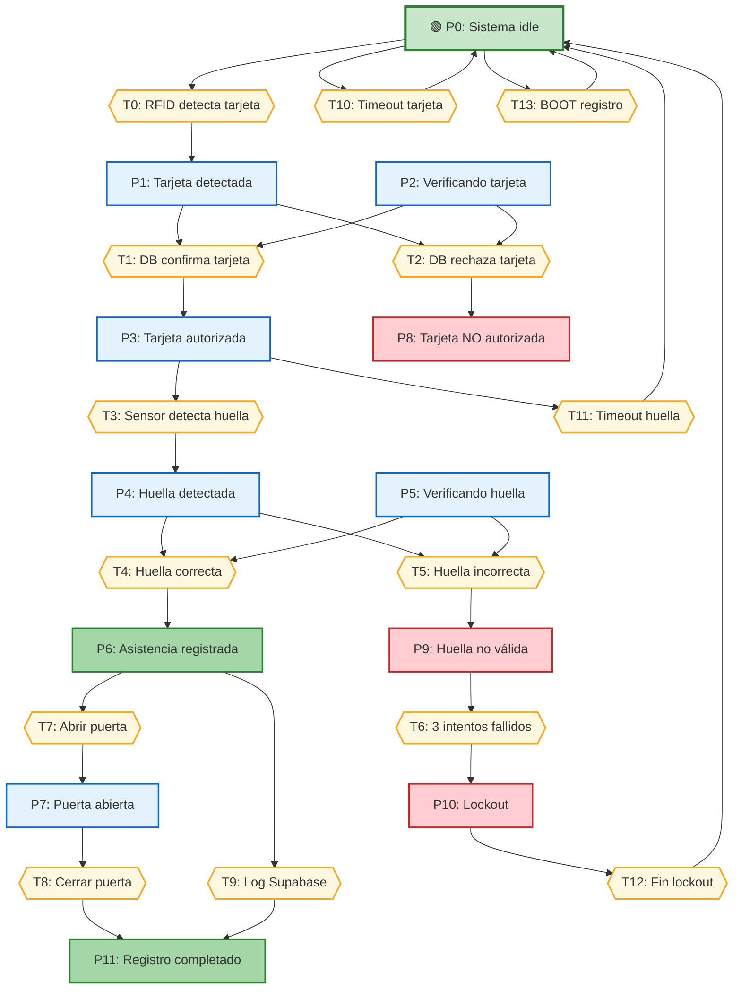
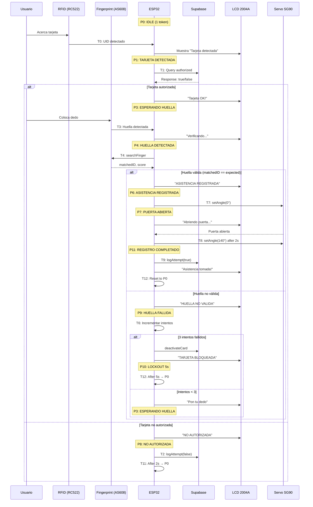

# ESP32 Attendance System — RFID + Fingerprint

Sistema automatizado de **registro de asistencia** de doble factor (RFID + huella dactilar) con ESP32,
LCD 2004A I2C, servo SG90 y backend en Supabase.

## Features

| | |
|---|---|
| Doble autenticación | Tarjeta RFID + huella dactilar (AS608) |
| LCD 2004A con iconos | Caracteres CGRAM personalizados (lock, check, card, finger, etc.) |
| Backend cloud | Supabase REST API — registro, logs, comandos remotos |
| Desbloqueo remoto | Polling de `pending_commands` cada 5s |
| Reconexión WiFi | Reintentos automáticos + recuperación NVS en cortes de luz |
| Borrado masivo | Hold BOOT 3s en modo registro |
| Puerta servo | Apertura/cierre gradual con `setAngleSmooth()` |
| LED + buzzer | Verde = acceso, rojo = denegado, patrones de pitido |

## Stack

| Componente | |
|---|---|
| MCU | ESP32 WROOM (30 pines) |
| Framework | ESP-IDF 6.0.2 |
| LCD | 2004A I2C (0x27) |
| RFID | RC522 (SPI) |
| Fingerprint | AS608 (UART) |
| Servo | SG90 (PWM LEDC) |
| Backend | Supabase (PostgreSQL + REST) |
| Build | idf.py / VS Code |

## Arquitectura

```
RFID (RC522) ─→ AccessControl ─→ AccessDB ─→ Supabase REST API
                   │
AS608 ─────────────┤
                   │
Servo SG90 ────────┘
                   │
LCD 2004A ─────────┤ ← Iconos CGRAM
                   │
Indicators ────────┤ ← LED verde/rojo + buzzer
```

### Módulos

- **AccessControl** — orquesta el flujo: RFID → validar → huella → abrir puerta → log
- **AccessDB** — cliente HTTP para Supabase (GET/POST/PATCH), parseo JSON manual
- **FingerprintManager** — comandos AS608 (enroll, search, deleteAll, setLED)
- **RFIDManager** — wrapper RC522 vía librería abobija/rc522
- **ServoManager** — PWM LEDC con movimiento gradual 1°
- **LCDI2C** — driver I2C con 8 caracteres CGRAM personalizados + efectos
- **Indicators** — LED verde, rojo, buzzer activo
- **WifiDriver** — conexión WiFi con manejo de eventos y reconexión

## Modelamiento del Proceso — Red de Petri

### Lugares (P) — Estados del Sistema

| Lugar | Descripción |
|-------|-------------|
| **P0** | Sistema idle (esperando tarjeta RFID) |
| **P1** | Tarjeta detectada (UID leído) |
| **P2** | Verificando tarjeta en Supabase |
| **P3** | Tarjeta autorizada (esperando huella) |
| **P4** | Huella detectada en sensor |
| **P5** | Verificando huella (match con fingerID) |
| **P6** | Asistencia registrada / Puerta abriendo |
| **P7** | Puerta abierta (servo a 0°) |
| **P8** | Tarjeta NO autorizada |
| **P9** | Huella no válida (intento fallido) |
| **P10** | Lockout activo (3 fallos → 5s) |
| **P11** | Registro completado |

### Transiciones (T) — Eventos/Acciones

| Transición | Disparador | Entrada → Salida |
|------------|------------|------------------|
| **T0** | RFID detecta tarjeta | P0 → P1 |
| **T1** | DB confirma tarjeta autorizada | P1, P2 → P3 |
| **T2** | DB rechaza tarjeta | P1, P2 → P8 |
| **T3** | Sensor detecta huella | P3 → P4 |
| **T4** | Huella coincide con fingerID | P4, P5 → P6 |
| **T5** | Huella no coincide | P4, P5 → P9 |
| **T6** | 3 intentos fallidos | P9 → P10 |
| **T7** | Servo abre puerta (0°) | P6 → P7 |
| **T8** | Servo cierra puerta (140°) | P7 → P11 |
| **T9** | Log en Supabase exitoso | P6 → P11 |
| **T10** | Timeout tarjeta (10s) | P0 → P0 |
| **T11** | Timeout huella (10s) | P3 → P0 |
| **T12** | Lockout expira (5s) | P10 → P0 |
| **T13** | BOOT pressed (modo registro) | P0 → P0 |

### Diagrama — Red de Petri



### Marcado Inicial

```
M(P0) = 1  (sistema idle)
M(P1-P11) = 0
```

### Secuencia de Ejecución



## Mapa de Pines

| GPIO | Dispositivo | Señal | Periférico |
|------|-------------|-------|------------|
| 5 | RC522 RFID | CS | SPI3 |
| 13 | SG90 Servo | PWM | LEDC CH0 |
| 16 | AS608 Huella | RX (ESP←FP) | UART2 |
| 17 | AS608 Huella | TX (ESP→FP) | UART2 |
| 18 | RC522 RFID | SCK | SPI3 |
| 19 | RC522 RFID | MISO | SPI3 |
| 21 | LCD 2004A | SDA | I2C0 |
| 22 | LCD 2004A | SCL | I2C0 |
| 23 | RC522 RFID | MOSI | SPI3 |
| 25 | Buzzer activo | Señal | GPIO |
| 26 | LED verde | Ánodo (+) | GPIO |
| 27 | LED rojo | Ánodo (+) | GPIO |
| 0 | BOOT button | Entrada (pull-up) | GPIO |

### Periféricos

- **I2C0**: 100 kHz, address 0x27, pull-ups internos
- **SPI3**: 5 MHz, mode 0
- **UART2**: 57600 baud, 8N1
- **LEDC**: 50 Hz, 14-bit, duty 410–2048 (0°–180°)

### Cableado rápido

```
LCD 2004A:  21→SDA  22→SCL  GND→GND  5V→VCC
RC522:      19→MISO 23→MOSI   18→SCK   5→CS   3.3V→VCC  GND→GND
AS608:      17→RX   16→TX    GND→GND  5V→VCC  (cruzar TX/RX)
SG90:       13→señal GND→marrón  5V→rojo
LED verde:  26→ánodo  GND→cátodo
LED rojo:   27→ánodo  GND→cátodo
Buzzer:     25→(+)    GND→(-)
BOOT:       GPIO 0 interno (botón EN)
```

## Setup

### Credenciales

```bash
cp .env.example .env
# Editar WIFI_SSID, WIFI_PASS, SUPABASE_URL, SUPABASE_KEY
```

Las credenciales se inyectan desde `.env` en tiempo de build via `main/CMakeLists.txt`.

### Supabase

1. Crear proyecto en [supabase.com](https://supabase.com)
2. SQL Editor → pegar `supabase_setup.sql`
3. Anotar Project URL y anon public key desde Settings > API

### Build & flash

```bash
idf.py build
idf.py -p COM3 flash
idf.py -p COM3 monitor   # Ctrl+] para salir
```

## Uso

### Login (default)
1. Acercar tarjeta RFID → LCD muestra nombre + pide huella
2. Poner dedo en AS608 (pitido al detectar)
3. Asistencia registrada → servo abre 2s, LED verde, log a Supabase

### Modo registro
1. Tocar BOOT → cambia entre login/registro
2. Acercar tarjeta nueva → poner dedo 2 veces
3. Si la tarjeta ya existe: verifica huella actual (misma = sin cambios, distinta = actualiza, nueva = enroll)
4. **Borrar todas las huellas**: hold BOOT 3s en modo registro

### Desbloqueo remoto
```sql
INSERT INTO pending_commands (command) VALUES ('unlock');
```
El ESP32 lo detecta en ~5s y abre la puerta.

## Troubleshooting

| Síntoma | Causa |
|---------|-------|
| RFID init fail / crash | Cableado SPI incorrecto o módulo sin alimentación |
| FP init fail | TX/RX al revés o VCC a 3.3V (conectar a 5V) |
| No arranca con FP conectado | GPIO 12 en boot — no usar como entrada con dispositivos 5V |
| WiFi no conecta | Credenciales en `.env` o NVS corrupta (el fix lo recupera) |
| Servo no se mueve | Engranaje suelto o falta corriente (fuente externa) |
| Error flash / serial | Bajar baud: `idf.py -b 115200 flash` |

## Estructura

```
main/
├── main.cpp                 # Entry point
├── CMakeLists.txt           # Genera secrets.h desde .env
├── supabase_setup.sql
├── .env.example
└── modules/
    ├── AccessControl.*      # Flujo acceso/registro
    ├── AccessDB.*           # HTTP Supabase
    ├── FingerprintManager.* # AS608 commands
    ├── Indicators.*         # LEDs + buzzer
    ├── LCDI2C.*             # LCD 2004A con CGRAM
    ├── RFIDManager.*        # RC522 wrapper
    ├── ServoManager.*       # PWM servo
    └── WifiDriver.*         # Conexión WiFi
```

## Estado

**Funcional completo.** RFID + Fingerprint + WiFi + Supabase + LCD + Servo.
